# Bangladesh Railway E-Ticket Availability Monitoring Assistant 🚆

A personal-use, real-time ticket availability monitoring assistant for Bangladesh Railway, powered by **FastAPI**, **Next.js 14**, and **Playwright** browser automation.

The official source of truth is **[https://eticket.railway.gov.bd/](https://eticket.railway.gov.bd/)**.

This tool is designed to solve a real-world problem: instead of manually refreshing the official railway website for hours hoping for a released seat, this assistant continuously monitors seat availability in the background and triggers an immediate audio siren, desktop notification, and optional Telegram alert the moment seats become available ($0 \rightarrow >0$).

---

## 🎯 What This Project Does

```
USER SPECIFIES CRITERIA → MONITORS OFFICIAL SITE → DETECTS AVAILABILITY (0 → >0) → ALARMS USER → OPENS OFFICIAL BOOKING FLOW
```

1. **You Specify Journey Criteria**:
   - Departure & Arrival stations (e.g. `DHAKA` to `SYLHET` or `CHITTAGONG`)
   - Journey date (within the official advance booking window)
   - Passenger count (1–4)
   - Train preference: specific trains (e.g. *Parabat Express*, *Subarna Express*) or **ALL MATCHING TRAINS**
   - Class preference: specific classes (e.g. *Snigdha*, *AC_S*, *Shovon Chair*) or **ALL MATCHING CLASSES**
2. **Persistent Browser Session**:
   - Uses Playwright with a persistent local Chromium user profile (`backend/.browser-profile`).
   - You log in manually to your official railway account **once**. Your session cookies and credentials remain stored locally on your own machine.
3. **Continuous Background Monitoring**:
   - Respectful polling interval (default 15s with random jitter between 10s and 30s).
   - Progressive exponential backoff if temporary errors occur (15s $\rightarrow$ 30s $\rightarrow$ 60s $\rightarrow$ 120s).
   - Stops polling immediately when you click **Stop Monitoring**.
4. **Resilient Change Detection Engine**:
   - Strictly tracks state transitions:
     - `0 -> 0`: Remains unavailable. No alert.
     - `0 -> >0`: **SEAT_AVAILABLE!** Triggers high-priority alerts.
     - `>0 -> >0`: Opportunity continues. No duplicate alerts.
     - `>0 -> 0`: Opportunity marked **CLOSED** (`SEAT_SOLD_OUT`).
     - `0 -> >0` (again): New alert opportunity triggered.
   - Suppresses alerts on uncertain or unparseable DOM states (`PARSE_ERROR`). Never triggers false alarms.
5. **Multi-Channel Alert System**:
   - **Audio Siren**: Web Audio API dual-frequency siren (880Hz / 660Hz) that sounds continuously until acknowledged or stopped.
   - **Browser Notifications**: Native HTML5 desktop notifications.
   - **Flashing Browser Tab**: Flashing title alerts (`🚨 2 SEATS! Parabat Express (Snigdha)`).
   - **Optional Telegram Bot**: Instant Markdown notification with a direct booking link.
6. **Dynamic Route & Date Train Discovery**:
   - The train list is **never hardcoded statically** across all routes.
   - Selecting **Dhaka → Sylhet** dynamically presents *Parabat Express*, *Kalni Express*, *Upaban Express*, and *Jayantik Express*.
   - Selecting **Dhaka → Chittagong** dynamically presents *Subarna Express*, *Sonar Bangla Express*, *Mohanagar Provati*, etc.
   - Weekly off-days (e.g., Subarna Express off on Monday, Kalni Express off on Friday) are accurately flagged as `NOT_SCHEDULED ON SELECTED DATE`.
7. **Canonical Station Resolution (English + Bengali + Aliases)**:
   - Full Unicode NFKC normalization.
   - Type in English (`Dhaka`, `Kamalapur`, `Chittagong`) or Bengali (`ঢাকা`, `চট্টগ্রাম`, `সিলেট`).
   - Autocompletes and resolves to the official railway canonical station name before querying.
8. **Guaranteed Bangladesh Standard Time (Asia/Dhaka, BST, UTC+6)**:
   - All backend timestamps are strictly emitted in ISO-8601 with explicit `Z` UTC indicators.
   - All frontend cards, tables, alerts, and event timelines format display in **Asia/Dhaka (BST)**, eliminating any 6-hour drift.
   - Includes real-time `● LIVE (BST)` and `⚠ STALE DATA` indicators.
9. **One-Click Official Booking**:
   - Provides an **[OPEN OFFICIAL BOOKING]** button.
   - The user completes the final ticket reservation, OTP, CAPTCHA, and payment securely on the official portal.

---

## 🛡️ Security, Privacy & Ethical Boundaries

- ❌ **No Automated Ticket Purchasing**: This is a personal monitoring assistant. It does **not** auto-buy tickets or reverse-engineer payment APIs.
- ❌ **No CAPTCHA / Bot Bypass**: Never bypasses security challenges, OTPs, or Cloudflare verification. If a challenge is detected, monitoring pauses safely, marks status as `MANUAL_ACTION_REQUIRED`, and brings up the visible browser for you to solve it manually.
- ❌ **No Credential Theft**: Never stores your Bangladesh Railway password, NID, phone OTP, bKash PIN, or card details.
- ❌ **No Site Hammering**: Respects official portal servers with configurable intervals (10–30s jitter) and automatic backoff.

---

## 🏗️ Architecture

```mermaid
flowchart TD
    subgraph UI ["Frontend (Next.js 14 + TailwindCSS + SSE)"]
        Dashboard["Monitoring Dashboard"]
        WatchForm["Watch Setup & Search Once Form"]
        LiveTable["Live Availability Table"]
        AlertCenter["Alert Center & Audio Siren Controller"]
        WatchList["Watch Jobs & Export (CSV/JSON)"]
        EventTimeline["Chronological Transition Audit Trail"]
        Diagnostics["System Health & Mode Switcher"]
    end

    subgraph Backend ["FastAPI Backend (Port 8000)"]
        WatchRouter["/api/watches CRUD & Control"]
        AlertRouter["/api/alerts & Siren Actions"]
        SessionRouter["/api/session & Browser Launcher"]
        DiagRouter["/health & /api/diagnostics"]
        SSEStream["/api/events/stream (Server-Sent Events)"]
        ChangeDetector["State Transition Engine"]
        WatchScheduler["Asyncio Watch Task Runner & Concurrency"]
        TelegramService["Telegram Bot Notifier (Optional)"]
    end

    subgraph Adapters ["Dual Adapter Architecture"]
        OfficialAdapter["OfficialRailwayAdapter (Playwright Automation)"]
        MockAdapter["MockRailwayAdapter (Dev & Offline Test Cycles)"]
    end

    subgraph External ["Official Website"]
        OfficialPortal["https://eticket.railway.gov.bd/"]
        BrowserProfile["Persistent Chromium Profile (backend/.browser-profile)"]
    end

    Dashboard <-->|REST + SSE| Backend
    WatchScheduler --> ChangeDetector
    ChangeDetector -->|0 -> >0 Transition| AlertRouter
    ChangeDetector -->|0 -> >0 Transition| TelegramService
    WatchScheduler --> Adapters
    OfficialAdapter --> BrowserProfile
    BrowserProfile --> OfficialPortal
```



---

## 🚀 Quick Start on Windows

### Method 1: The One-Click Runner (Recommended)

Simply double-click:
```bat
run_all.bat
```
This script automatically:
1. Verifies Python 3.10+ and Node.js 18+.
2. Installs missing backend dependencies (`requirements.txt`).
3. Installs missing frontend dependencies (`npm install`).
4. Launches the FastAPI backend on `http://localhost:8000`.
5. Launches the Next.js frontend on `http://localhost:3000`.
6. Opens your default web browser to the dashboard.

---

### Method 2: Individual Launch Scripts

- **`run_backend.bat`**: Starts the FastAPI backend with Playwright worker capability on `http://localhost:8000`.
- **`run_frontend.bat`**: Starts the Next.js dev server on `http://localhost:3000`.
- **`run_worker.bat`**: Opens a visible Chromium window connected to your persistent profile to log in to the official railway portal manually.

---

## 🔑 How to Log In to the Official Railway Portal

1. Run `run_worker.bat` (or click **Browser Login** in the dashboard header).
2. A visible Chromium browser window opens to `https://eticket.railway.gov.bd/login`.
3. Enter your official railway mobile number and password, solve any CAPTCHA, and complete the OTP verification.
4. Once you see your profile name on the official site, you can close the browser.
5. Your session cookies are stored in `backend/.browser-profile` and will automatically be reused by background monitoring tasks.

---

## 🔍 How to Create a Watch Job

1. Open `http://localhost:3000`.
2. Under **Availability Search & Watch Setup**:
   - Choose **From Station** (e.g. `DHAKA`).
   - Choose **To Station** (e.g. `SYLHET`).
   - Select **Journey Date**.
   - Select **Passenger Count** (1–4).
   - Select preferred trains (or keep **ALL MATCHING TRAINS**).
   - Select preferred seat classes (or keep **ALL CLASSES**).
3. Click **START MONITORING**.
4. The background task will poll at respectful intervals, and live availability appears in the **Live Availability Table**.
5. You can also click **Search Once** to perform a single check without continuous polling.

---

## 🚨 How Alerts Work

When seat availability transitions from 0 to $>0$:
1. **Audio Siren**: Web Audio API generates an alternating dual-tone emergency siren.
2. **Desktop Notification**: Native browser notification pops up with the train, class, and seat count.
3. **Flashing Tab Title**: Browser tab title alternates to grab your attention.
4. **Alert Center**: Displays an active alert card with detection details.
5. **Telegram (Optional)**: If configured, an instant alert is sent to your Telegram chat.
6. **Action**: Click **[OPEN OFFICIAL BOOKING]** to navigate straight to the official search results and buy your ticket before someone else grabs it.
7. Click **STOP SIREN** or **Acknowledge** to silence the sound.

---

## 📱 Telegram Setup (Optional)

To receive alerts on your phone via Telegram:
1. Open Telegram and create a bot using `@BotFather`. Copy the `TELEGRAM_BOT_TOKEN`.
2. Start a chat with your bot, then get your `TELEGRAM_CHAT_ID` using `@userinfobot`.
3. Add them to `backend/.env`:
   ```ini
   TELEGRAM_BOT_TOKEN=123456789:ABCdefGhIJKlmNoPQRstuVWXyz
   TELEGRAM_CHAT_ID=987654321
   ```
4. Restart the backend. Telegram notifications will now dispatch automatically.

---

## ⚙️ Configuration (.env)

`backend/.env.example`:
```ini
# Application Mode: MOCK (offline/testing) or LIVE (Official Playwright automation)
APP_MODE=MOCK
APP_ENV=development

# Polling Interval (in seconds) with jitter
MONITOR_INTERVAL_SECONDS=15
MONITOR_MIN_INTERVAL_SECONDS=10
MONITOR_MAX_INTERVAL_SECONDS=30

# Optional Telegram Notifications
TELEGRAM_BOT_TOKEN=
TELEGRAM_CHAT_ID=

# Database (defaults to local SQLite)
DATABASE_URL=sqlite:///./railway.db

# CORS Origins
CORS_ORIGINS=http://localhost:3000,http://127.0.0.1:3000
```

---

## 🧪 Testing & Verification

Run the automated test suite verifying state transitions, parser error handling, and API endpoints:
```powershell
backend\venv\Scripts\python.exe -m pytest backend/tests/ -v
```

Build and validate the Next.js frontend:
```cmd
cd frontend
cmd /c npm run build
```

---

## 📄 License
MIT License.
